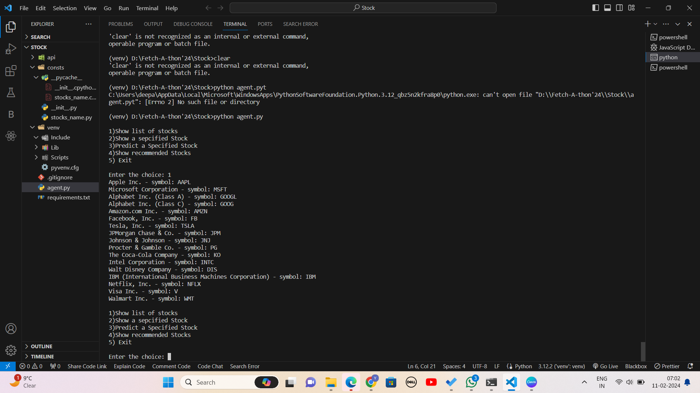
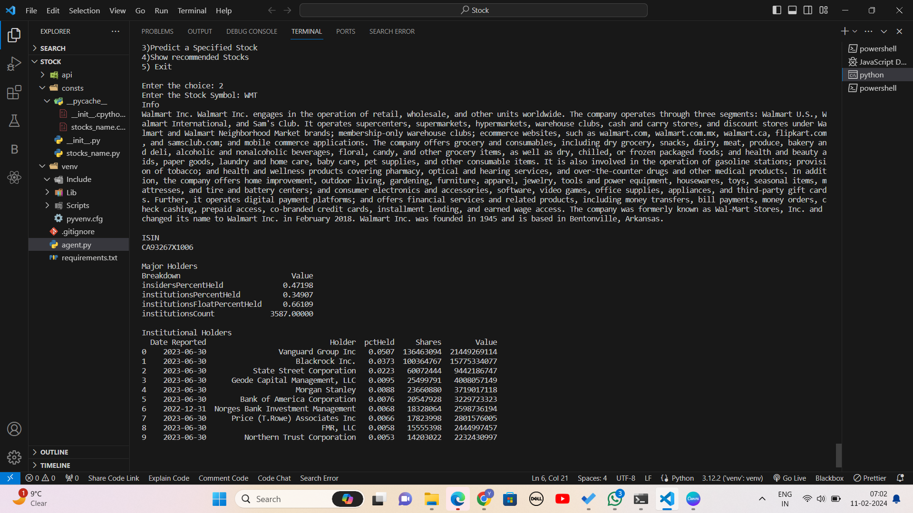
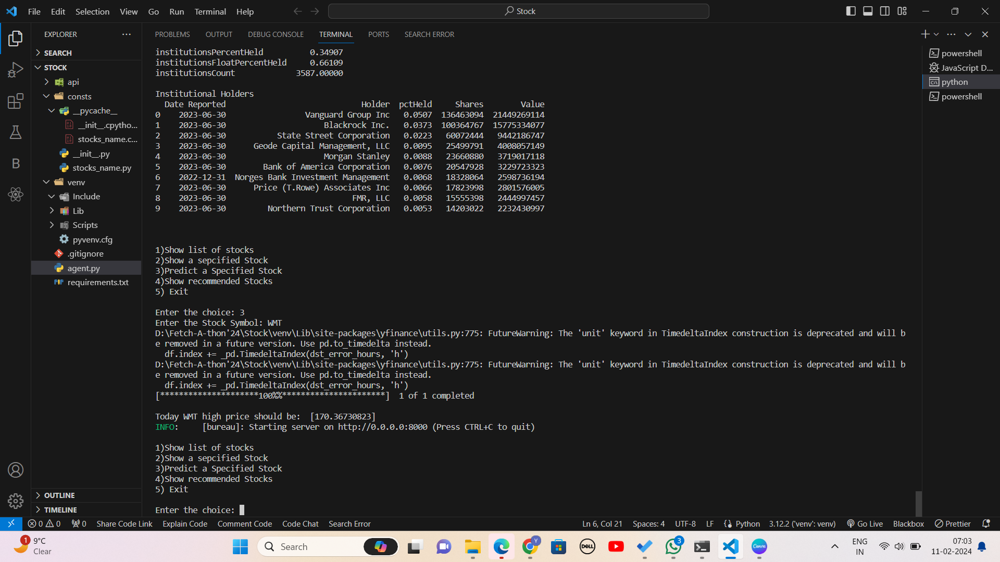
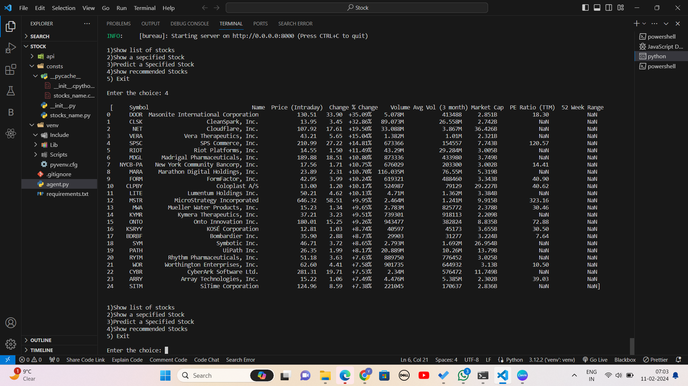

# Fetch-A-Thon'24

## Stock Preditor

Intro:
Stock Market Analysis and Prediction Agent: Develop an agent that analyzes stock market trends and predicts future movements. The agent should use historical data and current market indicators to provide insights and investment recommendations.

Description:













## Installations

To deploy this project run

```bash
  pip install -r requirments.txt
```

```bash
  python agent.py
```


## Libraries Used

- uAgents
- scikit-learn
- pandas
- lxml

## Team Members 

- Yashika Yadav
- Laksh Chauhan
- Shruti Sharma

## Team Id-FetchCrafters

